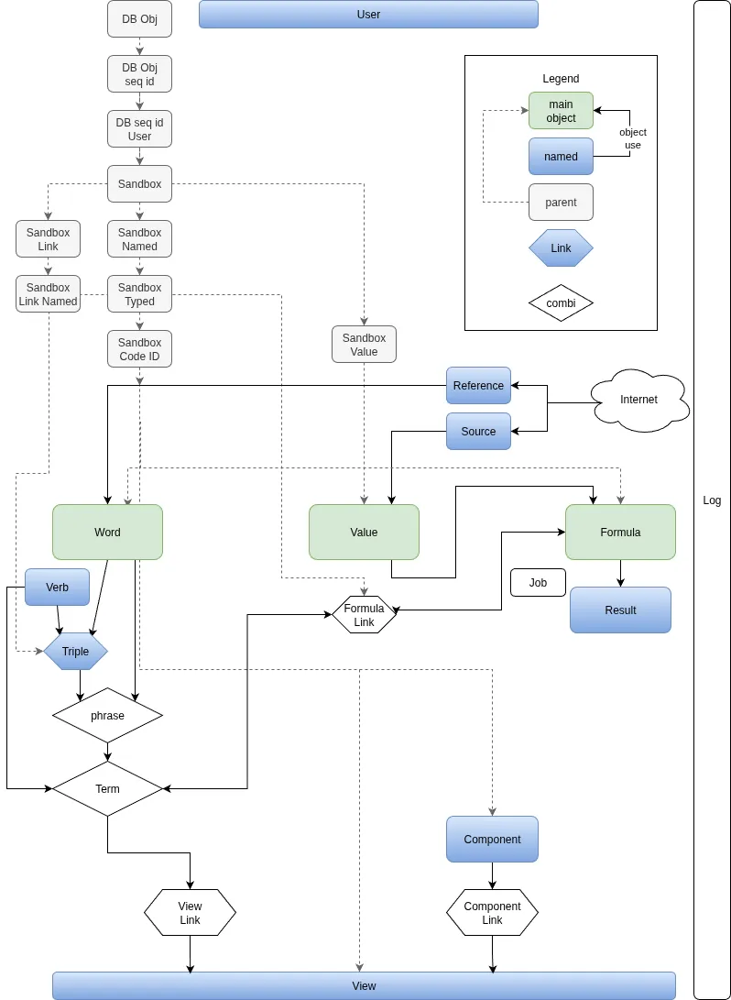

# Objects

## object sections

most objects have these sections in this order
- db const - const for the database like field names (moved to a *_db object)
- preserved - const word names of a words used by the system
- object vars - the variables of the object in order of the db const
- construct and map - including the mapping of the db row to the object
- set and get - interface for the object vars grouped by first set in order of db fields
- preloaded - select e.g. types from cache
- load - database access object (DAO) functions
- load sql - create the sql statements for database loading
- sql fields - create the field names for sql statements
- related - load related objects assigned to this component from the database
- cast - create an api object and set the vars from an api json
- api - create an api array for the frontend and set the vars based on a frontend api message
- im- and export - create an export object and set the vars from an import object
- modify - change potentially all variables of this object
- save - manage to update the database
- sql write fields - field list for writing to the database
- info - functions to make code easier to read
- internal - private functions to make code easier to read
- debug - internal support functions for debugging that must include dsp_id()

some sections are move to related classes to reduce the class size
- db const (*_db) - const for the database like field names (moved to a *_db object)
- preserved (shared\words) - const word names of a words used by the system

## Object structure

the target model object structure is:

    db_object - all database objects with the sql_table_create function
        db_object_seq_id - all database objects that have a unique id
            db_object_seq_id_user - all objects that are user-specific
                sandbox - a user sandbox object
                    sandbox_named - user sandbox objects that have a given name
                        sandbox_typed - named sandbox object that have a type and a predefined behavior
                            sandbox_code_id - named sandbox object that have a type, a predefined behavior and a code id
                                word - the base object to find values
                                source - a non automatic source for a value
                                formula - a calculation rule
                                view - to show an object to the user
                                component - an formatting element for the user view e.g. to show a word or number
                    sandbox_Link - user sandbox objects that link two objects
                        sandbox_link_named - user sandbox objects that link two objects
                            triple - link two words with a predicate / verb
                        formula_link - link a formula to a phrase
                        term_view - link a view to a term
                        component_link - to assign a component to a view
                        ref - to link a value to an external source
                    sandbox_value - to save a user-specific numbers
                        value - a single number added by the user
                        result - one calculated numeric result
                        value_time_series - a list of very similar numbers added by the user e.g. that only have a different timestamp  (TODO rename to series)
                phrase_group - a sorted list of phrases
                element - the parameters / parts of a formula expression for fast finding of dependencies (not the db normal form to speed up)
                change_log - to log a change done by a user
                    change_named - log of user changes in named objects e.g. word, triple, ...
                    change_link - log of the link changes by a user
                job - to handle processes that takes longer than the user is expected to wait
            phrase_group_link - db index to find a phrase group by the phrase (not the db normal form to speed up)
                phrase_group_word_link - phrase_group_link for a word
                phrase_group_triple_link - phrase_group_link for a triple
            sys_log - log entries by the system to improve the setup and code
            ip_range - to filter requests from the internet
    base_list - a list with pages
        change_log_list - to forward changes to the UI
        sys_log_list - to forward the system log entries to the UI
        job_list - to forward the batch jobs to the UI
        ip_range_list - list of the ip ranges
        sandbox_list - a user-specific paged list
            value_list - a list of values
            formula_list - a list of formulas
            element_list - a list of formula elements
            element_group_list - a list of formula element groups
            formula_link_list - a list of formula links
            result_list - a list of results
            figure_list - a list of figures
            view_list - a list of views
            component_list - a list of components
            component_link_list - a list of component_links
            sandbox_list_named - a paged list of named objects
                word_list - a list of words
                triple_list - a list of triples
                phrase_list - a list of phrases
                term_list - a list of terms
    type_object - to assign program code to a single object
        phrase_type - to assign predefined behaviour to a single word (and its children) (TODO combine with phrase type?)
        phrase_type - to assign predefined behaviour to a single word (and its children)
        formula_type - to assign predefined behaviour to formulas
        ref_type - to assign predefined behaviour to reference
        source_type - to assign predefined behaviour to source
        language - to define how the UI should look like
        language_form - to differentiate the word and triple name forms e.g. plural
    type_list - list of type_objects that is only load once a startup in the frontend
        verb - named object not part of the user sandbox because each verb / predicate is expected to have it own behavior; user can only request new verbs
        view_sys_list - list of all view used by the system itself
        phrase_types - list of all word or triple types
        verb_list - list of all verbs
        formula_type_list - a list of all formula types
        element_type_list - list of all formula element types
        formula_link_type_list - list of all formula link types
        view_type_list - list of all view types
        component_type_list - list of all component types
        component_link_type_list - list of all link types how to assign a component to a view
        component_pos_type_list - list of all component_pos_type
        ref_list - list of all refs (TODO use a sandbox_link list?)
        ref_type_list - list of all ref types
        source_type_list - list of all source types
        language_list - list of all UI languages
        language_form_list - list of all language forms
        change_action_list - list of all change types
        change_table_list - list of all db tables that can be changed by the user (including table of past versions)
        change_field_list - list of all fields in table that a user can change (including fields of past versions)
        job_type_list - list of all batch job types
    combine_object - a object that combines two objects
        combine_named - a combine object with a unique name
            phrase - a word or triple
            term - a word, triple, verb or formula
        figure - a value or result

    helpers
        phr_ids - just to avoid mixing a phrase with a triple id
        trm_ids - just to avoid mixing a term with a triple, verb or formula id
        fig_ids - just to avoid mixing a result with a figure id
        expression - to convert the user format of a formula to the internal reference format and backward

    model objects to be reviewed
        phrase_group_list - a list of phrase group that is supposed to be a sandbox_list
        element_group - to combine several formula elements that are depending on each other
        component_type - TODO rename to component_type and move to type_object?
        component_pos_type - TODO use a simple enum?
        ref_link_wikidata - the link to wikidata

## backend only vars

The frontend (`web/`) objects mirror the backend (`cfg/`) objects but omit vars that serve purely backend concerns: DB plumbing, calculation state, and eagerly loaded related objects. The following vars exist in the backend class but have no counterpart in the corresponding frontend class.

### sandbox (base, affects all domain objects)

| var | reason absent from frontend |
|---|---|
| `$rename_can_switch` | internal save-logic flag — whether saving can redirect to an existing object with the new name |
| `$usr_cfg_id` | DB row ID of the user-specific override record; the frontend only receives the effective merged values |
| `$owner_id` | stored as a FK int; the frontend uses `$owner` (a `user` object) instead |

### sandbox_link (base for triple, formula_link, component_link, ref, term_view, view_relation)

TODO deprecate

| var | reason absent from frontend |
|---|---|
| `$from_name` | string label for the "from" object type used in log messages (e.g. `"view"`); not needed for display |
| `$to_name` | string label for the "to" object type used in log messages |

### word

| var | reason absent from frontend |
|---|---|
| `$link_type_id` | list-context metadata: which relation caused this word to appear in a word_list; the frontend never builds word lists this way |
| `$view` | resolved default view object; requires a DB load the frontend does not perform |
| `$ref_lst` | array of external reference objects; loaded lazily in the backend, not sent to the frontend |

### triple

TODO add $code_id and $usage to the frontend object

| var | reason absent from frontend |
|---|---|
| `$name_given` | user-supplied name override (separate from the auto-generated form/verb/to name) |
| `$name_generated` | auto-generated name computed from the linked objects; the frontend derives it on the fly from `$from`/`$verb`/`$to` |
| `$code_id` | machine-readable identifier for system-fixed triples; not editable by users via the UI |
| `$usage` | frequency count; stored for ranking but not displayed in the basic object form |
| `$view` | resolved default view; requires DB load |
| `$ref_lst` | list of external references; not sent to the frontend |

### formula

| var | reason absent from frontend |
|---|---|
| `$ref_text_r` | right-hand side of the equation expression used as a work-in-progress field during calculation; purely internal to the formula engine |

### view

TODO add $style to the frontend object

| var | reason absent from frontend |
|---|---|
| `$cmp_lnk_lst` | full list of `component_link` objects loaded for rendering; the frontend builds its component list through `url_mapper` calls, not a stored list |
| `$trm_msk_lst` | full list of `term_view` links; loaded for backend rendering decisions |
| `$style` | resolved style `type_object`; the frontend receives the style ID via the API and resolves it from the local type cache |

### component

TODO add $style, $row_phrase and $word_id_col2 to the frontend object

| var | reason absent from frontend |
|---|---|
| `$link_type_id` | component link type; managed at the `component_link` level in the frontend |
| `$word_id_col2` | second column word for matrix-style components; the frontend receives this as an API field |
| `$obj` | generic linked object placeholder used during backend rendering |
| `$row_phrase` / `$col_phrase` / `$col_sub_phrase` | phrase references for table/matrix layout; resolved during backend rendering |
| `$frm` | formula object linked to this component; resolved during backend rendering |
| `$style` | resolved style `type_object`; frontend uses integer `$style_id` and resolves from cache |

### component_link

TODO add $style and $pos_type to the frontend object

| var | reason absent from frontend |
|---|---|
| `$pos_type` | resolved `type_object` for the position type; the frontend stores the integer `$pos_type_id` and resolves it from `type_lists` |
| `$style` | resolved `type_object` for the style; the frontend stores `$style_id` (int) |

### sandbox_value (base for value and result)

| var | reason absent from frontend |
|---|---|
| `$last_update` | timestamp of the last DB write; used for cache invalidation on the backend only |

### value

| var | reason absent from frontend |
|---|---|
| `$number` | the actual numeric value is hoisted to `sandbox_value` in the frontend (`$number` lives there) rather than in `value` directly; the frontend `value` class stores `$src` (source) instead |

### result

| var | reason absent from frontend |
|---|---|
| `$number` | same as value: the numeric payload lives at the `sandbox_value` level in the frontend |

### ref

| var | reason absent from frontend |
|---|---|
| `$name` | external display name fetched from the reference source; the frontend identifies refs by phrase + source, not by the cached name |
| `$code_id` | machine-readable identifier for fixed system references; not exposed in the UI form |

## database change setup

User Sandbox: values, formulas, formula_links, views and view elements are included in the user sandbox, which means, each user can exclude or adjust single entries

to avoid confusion words, formula names, triples and verbs may have a limited user sandbox, but a normal user can change the name, which will hopefully not happen often.

for words, formulas and verbs the user can add a specific name in any language

Admin edit: for triples (verbs), phrase_types, link_types, formula_types there is only one valid record and only an admin user is allowed to change it, which is also because these tables have a code id

Sources: every user can change it, but there is only one valid row

Saving: there are several methods to save user data
- not user-specific data like verbs, which are saved with the standard process
- user-specific data like formulas, which are saved base on the user sandbox functions
- user-specific data, which change very rarely and has code functionality linked like view types
- not user-specific data, which change only with a program update like the view component position type

Fixed server splitting (if not hadoop is used as the backend)
To split the load between to several servers it is suggested to move one word and all it's related values and results to a second server
further splitting can be done by another word to split in hierarchy order
e.g. use company as the first splitter and than ABB, Daimler, ... as the second or CO2 as the second tree
in this case the CO2 balance of ABB will be on the "company ABB server", but all other CO2 data will be on en "environment server"
the word graph should stay on the main server for consistency reasons

