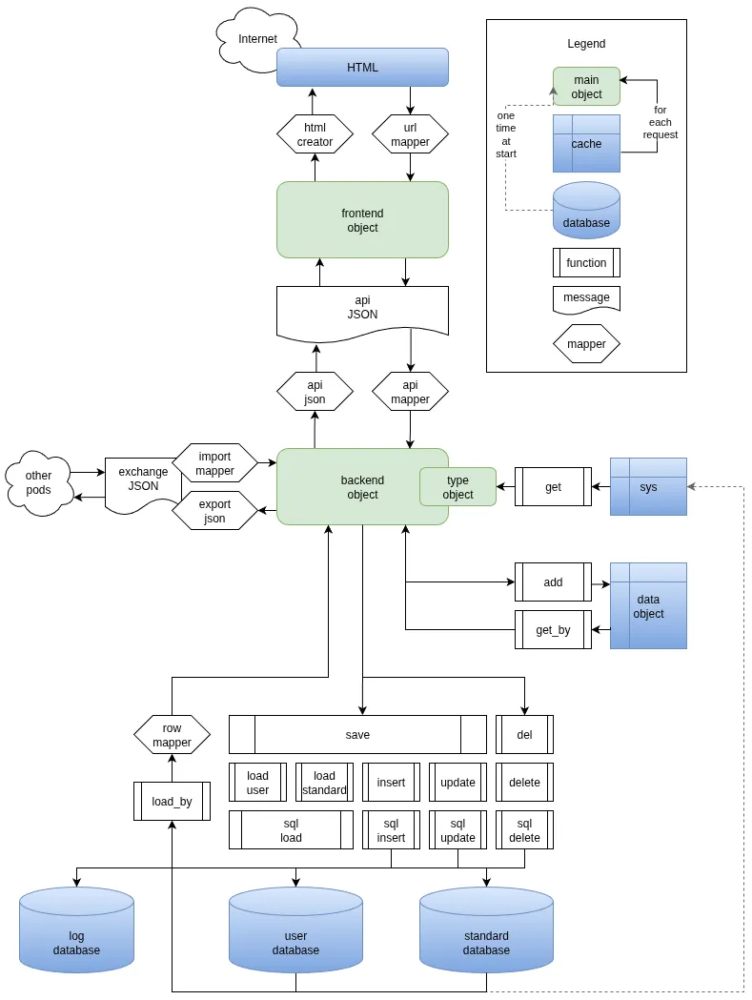

# main functions

## backend functions

The main backend objects have these main functions:

1. storage
   1. load_by_name: like all load_by_ function to retrieve the object data from the database by a unique key
   2. save: to add or update the object in the database
   3. del: to exclude or delete the object 
2. mapper
   1. row_mapper: to set the object vars based on the database row
   2. api_mapper: to set the object vars based on a JSON message from the frontend.
   3. import_mapper: to set the object vars based on a JSON message from any external system or another pod. The import JSON never used
   4. api_json(_array): create a JSON api message for the frontend
   5. export_json: create a JSON message for another pod or another external system
3. cache
   1. add: to add or update an object in the cache
   2. get_by: to retrieve an object from the cache via hash table
   3. unset: to remove an object from the cache
4. info
   1. diff_msg: report the difference between two objects
5. internal
   1. fill: set any missing vars of the object based on the given object

## messages

1. The api JSON message is only used within the pod and is using the id of the database
2. Import and export JSON messages are used to transfer data between pods or to im- and export from external systems
   the import and export JSON messages always use the name and never any database id 

## vars

1. msg: created with a user action to collect all messages and contains the requesting user 

## cache

1. sys: types, times and system configuration
2. db_con: database connection

## frontend functions

The main frontend objects have these main functions:

1. storage
    1. load_by_name: like all load_by_ function to retrieve the object data from the database by a unique key
    2. save: to add or update the object in the database
    3. del: to exclude or delete the object
2. mapper
    1. row_mapper: to set the object vars based on the database row
    2. api_mapper: to set the object vars based on a JSON message from the frontend.
    3. import_mapper: to set the object vars based on a JSON message from any external system or another pod. The import JSON never used
    4. api_json(_array): create a JSON api message for the frontend
    5. export_json: create a JSON message for another pod or another external system

## pod

a pod may contain more than one database server, but it has one api and one system of consistent database ids

## overview

